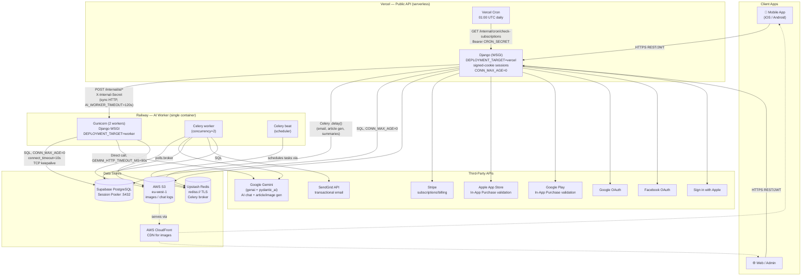

# Mendreo API — System Architecture

_Last updated: 2026-07-26_

This document describes every connected component in the Mendreo production stack: what it does, how it's deployed, and how it talks to everything else.

---

## 1. High-level diagram



---

## 2. Components

### 2.1 Client applications
- **Mobile app** (iOS / Android) and **Web/Admin** clients talk to the public API over HTTPS using JWT bearer tokens (`rest_framework_simplejwt`) or session auth for the admin.
- All client traffic goes to **Vercel** — the Railway worker is never called directly by clients.

### 2.2 Vercel — public API (`DEPLOYMENT_TARGET=vercel`)
- **What it is:** the Django app running as a Vercel serverless function (WSGI entrypoint: `backend/mendreo/wsgi.py`).
- **Responsibilities:** authentication, CRUD for all resources (users, sessions, exercises, posts, packages, subscriptions, files, etc.), and delegating slow/long-running work.
- **Key settings:**
  - `SESSION_ENGINE = signed_cookies` — avoids a DB round-trip per request in a stateless serverless environment.
  - `DATABASE_CONN_MAX_AGE = 0` — no connection reuse across invocations; each invocation gets a fresh (pooled) connection from Supabase.
  - Slim dependency set (`requirements-vercel.txt`) to stay under Vercel's function size limit.
- **Build:** `vercel.json` runs `migrate` + `collectstatic` at build time; function has `maxDuration: 120s`, `memory: 1024MB`.
- **Cron:** Vercel Cron calls `GET /internal/cron/check-subscriptions` daily at 01:00 UTC with a `Bearer CRON_SECRET` header to re-validate active subscriptions.

### 2.3 Railway — AI worker (`DEPLOYMENT_TARGET=worker`)
A **single Railway service/container** runs three processes together via `deploy/worker/start.sh`:

| Process | Role |
|---|---|
| **Gunicorn** (2 sync workers, `--preload`) | Serves the same Django app as Vercel, but is the one that actually calls Gemini directly. Binds `[::]:${PORT}` (dual-stack, handles both IPv4 and IPv6 — required for Railway's IPv6-routed edge). |
| **Celery worker** (concurrency 2) | Consumes background tasks from Redis: email sending, AI article/image generation, chat/session summarization. |
| **Celery beat** | Schedules periodic tasks (e.g. daily summary generation) into the broker. |

- **Why it exists:** Vercel functions have hard execution time limits and can't run a persistent Celery worker/beat process. The worker is a normal long-running server, so it can run Gemini calls with a generous timeout and host Celery.
- **Internal-only routes** (called by Vercel, never by clients directly):
  - `POST /internal/ai/message-response` — generate the AI's reply to a user chat message.
  - `POST /internal/ai/session-greeting` — generate the opening message when a user starts an exercise session.
  - Both require header `X-Internal-Secret: <INTERNAL_API_SECRET>` (shared secret, same value on Vercel and worker).
- **Health checks:** `GET /` and `GET /healthz` are answered directly at the WSGI layer, before Django URL routing loads — so health probes stay instant even while the rest of the app is starting up or under load.
- **Resilience settings** (`start.sh`): `--timeout 30` (kill and replace a stuck worker quickly), `--max-requests 500` (periodic worker recycling), `BROKER_URL` auto-upgraded from `redis://` to `rediss://` for Upstash hosts before Celery's CLI reads it.

### 2.4 Supabase — PostgreSQL
- Managed Postgres reached via **Supabase's Session Pooler** (`*.pooler.supabase.com:5432`), not a direct connection — the pooler handles connection reuse so the app itself doesn't need to hold long-lived connections open.
- Both Vercel and the worker use `DATABASE_CONN_MAX_AGE=0` (fresh connection per request), with `connect_timeout=10s` and TCP keepalive configured on the worker so a silently-dropped pooled connection is detected quickly instead of hanging a request.
- Single shared database — no read replicas or per-environment DB split in production.

### 2.5 Upstash Redis
- Serves as the **Celery broker only** (no cache/results backend configured — `results: disabled`).
- Requires **TLS** (`rediss://`) — the public Upstash endpoint rejects plain `redis://` connections.
- Shared between Vercel (which enqueues tasks) and the Railway worker (which runs Celery worker + beat to consume them).

### 2.6 AWS S3 + CloudFront
- **S3** (`eu-west-1`) stores per-consumer chat logs (plain text) and uploaded images/assets.
- **CloudFront** fronts S3 for serving images/assets to clients at lower latency (`AWS_CLOUD_FRONT_DOMAIN`, `AWS_CLOUD_FRONT_RESIZER_DOMAIN`).
- Accessed from both Vercel and the worker (file/image upload endpoints, and the worker's chat-log-append during AI conversations).

### 2.7 Google Gemini (AI)
- Used via `google-genai` + `pydantic_ai` for:
  - **Chat responses** (`api/utils/Agent.py`) — a `pydantic_ai.Agent` with tool-calling (fetch an asset/exercise to show the user) and structured output (`GeneralResponse` / `ExerciseResponse`).
  - **Article & image generation** (`api/utils/AI.py`) — used by scheduled/background content generation tasks.
  - **Session/exercise summaries** — updates a consumer's running summary after each session.
- All Gemini calls set an explicit HTTP timeout (`GEMINI_HTTP_TIMEOUT_MS`, default 90s) — without this, a slow/unreachable Gemini API could hang a worker indefinitely.
- When `AI_WORKER_URL` + `INTERNAL_API_SECRET` are set (i.e. on Vercel), chat/greeting requests are forwarded to the Railway worker over HTTP instead of calling Gemini in-process; the worker itself always calls Gemini directly.

### 2.8 Payments & subscriptions
- **Stripe** — web subscription billing (`api/utils/StripeSubscription.py`).
- **Apple App Store** / **Google Play** — in-app purchase receipt validation (`api/utils/InAppPayment.py`).
- A subscription's status is re-validated against whichever provider issued it at most once per hour per consumer, and once daily for all consumers via the Vercel Cron job.

### 2.9 Auth providers
- **JWT** (`rest_framework_simplejwt`) — primary API auth for mobile/web clients.
- **Social login** via `social_django` / `social_core`: **Google**, **Facebook**, and **Sign in with Apple** (custom `AppleOAuth2` / `AppleWebOAuth2` backends).
- **SendGrid** (`api/utils/Mail.py`) — transactional email via SendGrid's HTTP API (not SMTP) for things like verification emails; actual sends are dispatched through Celery so they never block a request.

### 2.10 CI
- GitHub Actions (`.github/workflows/django.yml`) runs the Django test suite (with a local Postgres service) on push/PR.

---

## 3. Request flow examples

### 3.1 A user sends a chat message
```
Mobile app
  → POST /messages  (Vercel, JWT auth)
    → Vercel Django saves the message
    → Vercel Django calls Railway worker:
        POST /internal/ai/message-response
        X-Internal-Secret: ***
    → Railway worker calls Gemini (pydantic_ai Agent, tool calls, structured output)
    → Railway worker returns the agent's reply
  → Vercel Django saves the reply, returns it to the client synchronously
```

### 3.2 A background task (e.g. session summary update)
```
Vercel Django or Railway worker
  → task.delay_on_commit(...)  → enqueued on Upstash Redis (rediss://)
Railway worker's Celery process
  → picks up the task from Redis
  → calls Gemini / writes to S3 / updates Postgres as needed
```

### 3.3 Nightly subscription check
```
Vercel Cron (01:00 UTC)
  → GET /internal/cron/check-subscriptions  (Bearer CRON_SECRET)
    → Vercel Django re-validates each active subscription against
      Stripe / Apple / Google as appropriate
```

---

## 4. Environment variables (who needs what)

| Variable | Vercel | Railway worker | Purpose |
|---|:---:|:---:|---|
| `DEPLOYMENT_TARGET` | `vercel` | `worker` | Branches settings (sessions, DEBUG, ALLOWED_HOSTS, Celery eager mode) |
| `GENERAL_SECRET_KEY` | ✅ | ✅ (same value) | Django `SECRET_KEY` |
| `GENERAL_DEBUG` | `False` | `False` | Never `True` in production |
| `SUPABASE_DEV_DB_URL` | ✅ | ✅ | Postgres session-pooler connection string |
| `BROKER_URL` | ✅ | ✅ (same value) | `rediss://...` Upstash Redis, Celery broker |
| `AI_WORKER_URL` | ✅ (Railway worker's public URL) | ❌ (never set) | Vercel → worker AI delegation |
| `INTERNAL_API_SECRET` | ✅ | ✅ (same value) | Auth for `/internal/*` routes |
| `CRON_SECRET` | ✅ | — | Auth for the Vercel Cron job |
| `GOOGLE_API_KEY` | ✅ | ✅ | Gemini API key |
| `AWS_ACCESS_KEY_ID` / `AWS_SECRET_ACCESS_KEY` / `AWS_S3_BUCKET_NAME` | ✅ | ✅ | S3 access |
| `SENDGRID_API_KEY` | ✅ | ✅ | Transactional email |
| `STRIPE_SECRET_KEY` | ✅ | ✅ | Payments |
| `APPLE_IN_APP_SHARED_SECRET` | ✅ | ✅ | Apple IAP receipt validation |
| `GOOGLE_OAUTH2_KEY` / `_SECRET`, `FACEBOOK_CLIENT_ID` / `_SECRET_KEY`, `APPLE_*` | ✅ | as needed | Social login |

---

## 5. Notable design decisions & hard-won lessons

- **Backend lives under `backend/`, not repo-root `mendreo/`** — avoids Python package name shadowing on Vercel.
- **Health checks bypass Django entirely** (`backend/mendreo/wsgi.py`) — `GET /` and `GET /healthz` return instantly without touching URL routing, middleware, the database, or Redis, so they stay reliable even if something else in the app is degraded.
- **Gunicorn binds `[::]` only, not `[::]` + `0.0.0.0` together** — on Linux, a dual-stack `[::]` socket already accepts IPv4; binding both on the same port causes the second bind to fail and the app to silently never serve traffic.
- **`BROKER_URL` is normalized to TLS in `start.sh` before Celery's CLI reads it** — Celery's own `-b/--broker` CLI flag reads the `BROKER_URL` env var directly and will silently override any Python-level fix.
- **`ALLOWED_HOSTS` always includes `.railway.app`** — unconditionally, not gated on `DEPLOYMENT_TARGET`, since only a Railway-hosted deployment would ever receive that Host header.
- **`django.security.*` logger is routed to console only, not `mail_admins`** — Django's default behavior emails admins on security exceptions (e.g. `DisallowedHost`) via a synchronous, unbounded-timeout SMTP call, which can hang a worker for a long time if outbound SMTP is slow/blocked.
- **DB connections are not held open (`CONN_MAX_AGE=0`) on either service** — both Vercel (serverless) and the Railway worker rely on Supabase's own connection pooler rather than layering Django's own long-lived connections on top of it.
