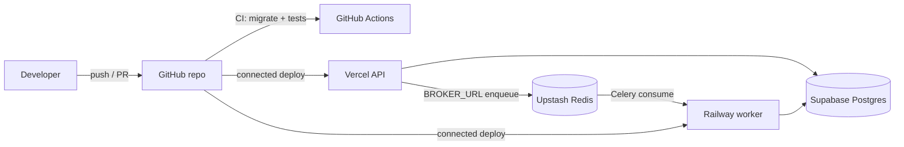
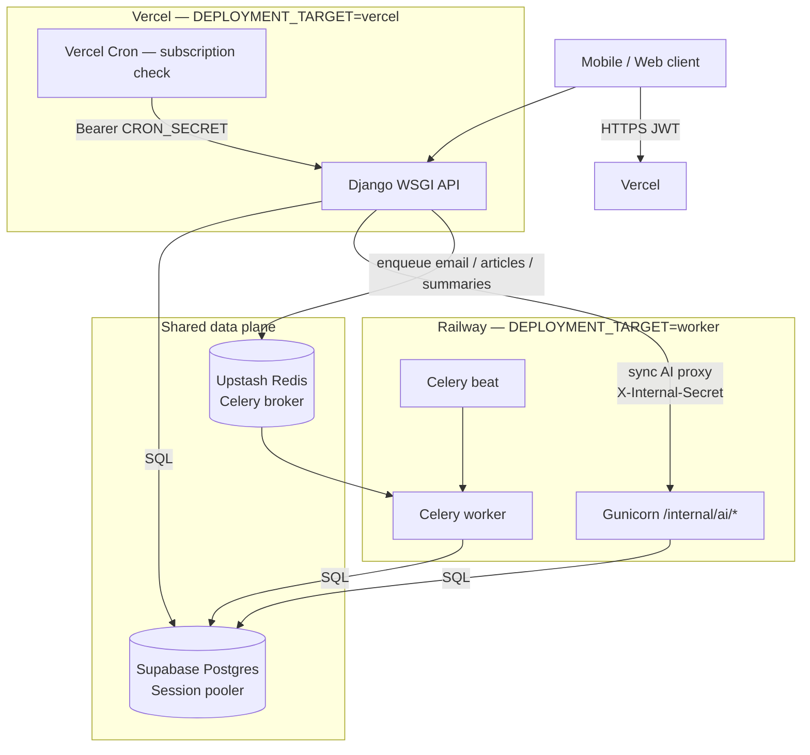

# Hybrid deployment: Vercel + Railway

This guide covers the recommended production layout for the Mendreo API.

## Architecture overview

| Component | Platform | Role |
|---|---|---|
| **Source + CI** | GitHub | Repo of record; Actions run Django tests on every push |
| **Public API** | Vercel | Django/DRF HTTP surface (auth, CRUD, uploads metadata, cron) |
| **AI + jobs** | Railway | Long-running Gunicorn + Celery worker + beat (Gemini AI) |
| **Database** | Supabase | Managed PostgreSQL via Session pooler |
| **Queue** | Upstash Redis | Celery broker shared by Vercel (enqueue) and Railway (consume) |

Clients (mobile/web) talk only to Vercel. Vercel forwards AI work to Railway over an authenticated internal HTTP call, and enqueues background jobs onto Redis for the Railway Celery worker. Both runtimes read and write the same Supabase Postgres database.

### Deploy pipeline (GitHub → platforms)



GitHub does **not** deploy via Actions. Vercel and Railway each import the repo and build on push (`vercel.json` / `railway.toml`). Actions only validate the codebase (`.github/workflows/django.yml`).

### Runtime request flow



### ASCII overview

```
                         ┌──────────────────┐
                         │     GitHub       │
                         │  source + CI     │
                         └────────┬─────────┘
              deploy on push      │      deploy on push
                 ┌────────────────┼────────────────┐
                 ▼                                 ▼
  Client ──► ┌─────────────┐              ┌─────────────────┐
             │   Vercel    │  AI HTTP     │    Railway      │
             │ Django API  │ ───────────► │ Gunicorn + AI   │
             │ + Cron      │  Celery      │ Celery worker   │
             └──────┬──────┘  enqueue     │ + beat          │
                    │            │        └────────┬────────┘
                    │            ▼                 │
                    │     ┌────────────┐           │
                    │     │ Upstash    │ ──────────┘
                    │     │ Redis      │  consume
                    │     └────────────┘
                    │            ┌────────────┐
                    └───────────►│ Supabase   │◄─────────────┘
                                 │ Postgres   │
                                 └────────────┘
```

## Why hybrid?

| Concern | Vercel alone | Hybrid |
|---|---|---|
| AI chat latency | Function timeout / cold starts | Worker runs Gemini with 300s timeout |
| Celery beat | Cannot run | Worker runs beat |
| Email / article gen | Blocks or missing | Queued via Redis |
| CRUD endpoints | Good fit | Still on Vercel |

Client API contracts stay the same — `POST /messages` still returns the agent reply synchronously. Vercel forwards AI work to the worker over HTTP.

## How each service fits

### GitHub
- Holds the single Django codebase (`backend/`, `vercel.json`, `railway.toml`, `deploy/worker/`).
- **GitHub Actions** (`.github/workflows/django.yml`) runs on every push: PostGIS Postgres service, migrate, `api.tests` with coverage.
- Deploy is **not** driven by Actions. Vercel and Railway watch the same repo and ship on push from their dashboards.

### Vercel
- Public API entrypoint (`backend/mendreo/wsgi.py`, lighter `requirements-vercel.txt`).
- Handles auth/JWT, CRUD, S3 upload metadata, and daily subscription cron.
- Sets `DEPLOYMENT_TARGET=vercel`, `AI_WORKER_URL` → Railway, `DATABASE_CONN_MAX_AGE=0`.
- Enqueues Celery tasks to Upstash Redis; does not run a Celery worker itself.

### Railway
- Builds `deploy/worker/worker.dockerfile` (full `requirements.txt`).
- Runs Gunicorn (AI internal routes), Celery worker, and Celery beat via `deploy/worker/start.sh`.
- Sets `DEPLOYMENT_TARGET=worker`; does **not** set `AI_WORKER_URL` (AI runs in-process).
- Consumes Redis tasks and serves `/internal/ai/*` for Vercel.

### Supabase (Postgres)
- Sole application database (users, sessions, messages, subscriptions, etc.).
- Connect with the **Session pooler** (`*.pooler.supabase.com:5432`) via `SUPABASE_DEV_DB_URL` or `DATABASE_*`.
- Auth is Django/JWT in-app — not Supabase Auth. File blobs live on AWS S3, not Supabase Storage.

### Redis (Upstash)
- Celery **broker only** (`BROKER_URL=rediss://…upstash.io:6379`).
- Same URL on Vercel (publish) and Railway (consume).
- Tasks include email, chat/daily summaries, article generation, and subscription checks.

### Example: `POST /messages`
1. Client → **Vercel** with JWT; message row written to **Supabase**.
2. Vercel calls **Railway** `POST /internal/ai/message-response` with `X-Internal-Secret`.
3. Railway loads context from Supabase, runs Gemini, writes the agent message, returns its id.
4. Vercel reloads that message from Supabase and returns it to the client (sync reply).
5. Side work (email, summaries, articles) goes Vercel → **Redis** → Railway Celery.

---

## 1. Shared infrastructure

### PostgreSQL (Supabase)

Use the **Session pooler** connection string (`*.pooler.supabase.com:5432`).

Set either:

```env
SUPABASE_DEV_DB_URL=postgresql://postgres.<ref>:<pass>@aws-0-<region>.pooler.supabase.com:5432/postgres
```

or individual `DATABASE_*` vars.

### Redis (Upstash)

```env
BROKER_URL=rediss://default:<token>@<host>.upstash.io:6379
```

Use the same `BROKER_URL` on both Vercel and the worker.

### Shared secrets

Generate strong random values for:

```env
INTERNAL_API_SECRET=<random>   # Vercel → worker AI calls
CRON_SECRET=<random>           # Vercel Cron → subscription check
GENERAL_SECRET_KEY=<random>    # Django (same on both services)
```

---

## 2. Deploy the worker (Railway)

### Option A: Railway (recommended)

1. Create a new Railway project from this repo.
2. Railway reads `railway.toml` and builds `deploy/worker/worker.dockerfile`.
3. Set environment variables (see below).
4. Note the public URL, e.g. `https://mendreo-worker.up.railway.app`.

### Option B: Local / Docker

```bash
docker build -f deploy/worker/worker.dockerfile -t mendreo-worker .
docker run --env-file .env.local -p 8000:8000 mendreo-worker
```

### Option C: Shell script (dev)

```bash
bash scripts/run_worker.sh
```

### Worker environment variables

```env
DEPLOYMENT_TARGET=worker
GENERAL_SECRET_KEY=<same-as-vercel>
GENERAL_DEBUG=False
GENERAL_HOST_DOMAIN=.railway.app,your-worker-domain.com
DATABASE_* or SUPABASE_DEV_DB_URL
BROKER_URL=rediss://...
GOOGLE_API_KEY=...
AWS_*=...
SENDGRID_API_KEY=...
STRIPE_SECRET_KEY=...
INTERNAL_API_SECRET=<same-as-vercel>
# Do NOT set AI_WORKER_URL on the worker (AI runs locally there)
```

The worker exposes:

| Endpoint | Purpose |
|---|---|
| `GET /` | Health check |
| `POST /internal/ai/message-response` | AI chat (called by Vercel) |
| `POST /internal/ai/session-greeting` | Exercise session opener |
| All public API routes | Available but normally unused |

Internal endpoints require header: `X-Internal-Secret: <INTERNAL_API_SECRET>`

---

## 3. Deploy the API (Vercel)

1. Import the GitHub repo at [vercel.com](https://vercel.com).
2. Framework preset: **Django** (auto-detected via `manage.py`).
3. Root directory: repository root.
4. Add environment variables:

```env
DEPLOYMENT_TARGET=vercel
GENERAL_SECRET_KEY=<same-as-worker>
GENERAL_DEBUG=False
GENERAL_HOST_DOMAIN=.vercel.app,your-api-domain.com
DATABASE_* or SUPABASE_DEV_DB_URL
DATABASE_CONN_MAX_AGE=0
BROKER_URL=rediss://...
AI_WORKER_URL=https://mendreo-worker.up.railway.app
INTERNAL_API_SECRET=<same-as-worker>
CRON_SECRET=<random-for-vercel-cron>
AI_WORKER_TIMEOUT=120
VERCEL_SUPPORT_LARGE_FUNCTIONS=1
GOOGLE_API_KEY=...
AWS_*=...
SENDGRID_API_KEY=...
STRIPE_SECRET_KEY=...
# OAuth / survey vars as needed
```

5. Deploy. Vercel uses `backend/mendreo/wsgi.py` as the entrypoint, `requirements-vercel.txt`, and `vercel.json` for migrate/collectstatic/timeouts + cron.

### Vercel Cron

`vercel.json` schedules daily subscription validation at 1:00 AM UTC:

```
GET /internal/cron/check-subscriptions
Authorization: Bearer <CRON_SECRET>
```

Set `CRON_SECRET` in Vercel env vars (Vercel sends it automatically when configured).

---

## 4. Verify

```bash
# Vercel health
curl https://your-api.vercel.app/

# Worker health
curl https://your-worker.railway.app/

# End-to-end chat (requires auth token)
curl -X POST https://your-api.vercel.app/messages \
  -H "Authorization: Bearer <token>" \
  -H "Content-Type: application/json" \
  -d '{"text":"Hello","session":"<session_id>","consumer":"<consumer_id>"}'
```

---

## 5. Local development

Without a worker, AI runs inline (same as before):

```bash
cp .env.local.example .env.local
# Leave AI_WORKER_URL unset
bash scripts/setup_dev_env.sh
bash run_dev.sh
```

To test hybrid locally:

```bash
# Terminal 1
DEPLOYMENT_TARGET=worker bash scripts/run_worker.sh

# Terminal 2 — in .env.local:
# AI_WORKER_URL=http://127.0.0.1:8000
# INTERNAL_API_SECRET=dev-internal-secret
bash run_dev.sh
```

---

## Environment variable reference

| Variable | Vercel | Worker | Local |
|---|---|---|---|
| `DEPLOYMENT_TARGET` | `vercel` | `worker` | unset / `local` |
| `AI_WORKER_URL` | worker URL | unset | unset or worker URL |
| `INTERNAL_API_SECRET` | yes | yes | optional |
| `CRON_SECRET` | yes | no | no |
| `BROKER_URL` | yes | yes | `memory://` |
| `CELERY_TASK_ALWAYS_EAGER` | auto `False` | auto `False` | auto `True` if `DEBUG` |
| `DATABASE_CONN_MAX_AGE` | `0` (default) | `300` (default) | `300` (default) |

---

## Troubleshooting

| Symptom | Fix |
|---|---|
| `POST /messages` 403 from worker | Check `INTERNAL_API_SECRET` matches on both services |
| Chat timeout on Vercel | Increase `vercel.json` `maxDuration` and `AI_WORKER_TIMEOUT` |
| Emails not sending | Confirm `BROKER_URL` and worker Celery process are running |
| Subscriptions not checked | Confirm Vercel Cron is enabled and `CRON_SECRET` is set |
| DB connection errors on Vercel | Use Supabase Session pooler; keep `DATABASE_CONN_MAX_AGE=0` |
| `FUNCTION_INVOCATION_FAILED` / `No module named 'mendreo.settings'` | Redeploy latest commit. The Django app lives under `backend/` (not repo-root `mendreo/`) to avoid Python package shadowing on Vercel. Set `DEPLOYMENT_TARGET=vercel`. Do **not** set `PYTHONPATH`. |
